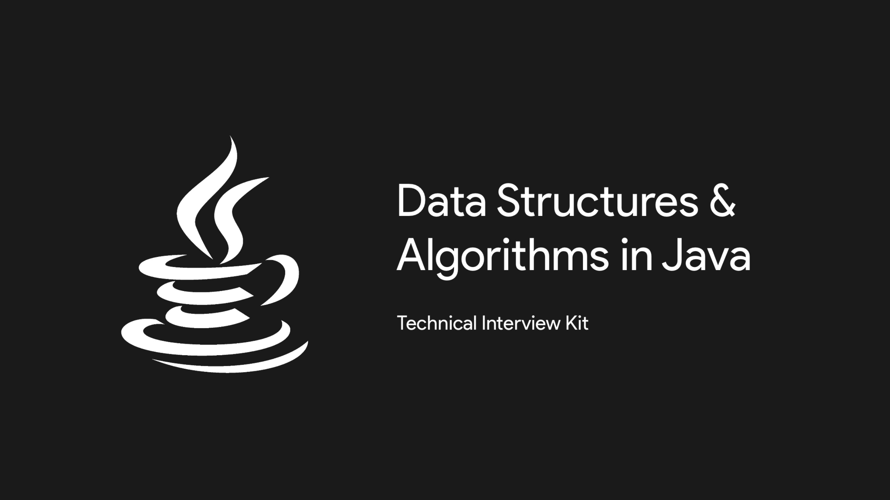

## Note:
- The best way to prepare would be to clone this repo and mark the problems as completed as you progress along. 
- Every problem in this repo will be linked to a youtube video which explains how to solve it.
- If you're interested in kotlin code, check out [DSA_Kotlin Repo](https://github.com/SyamSundarKirubakaran/DSA_Kotlin).
- Show some :heart: by giving this repo a :star:

## Topics:
- [Arrays](#Array-Problems)
- [Trees](#Tree-Problems)
- [Linked List](#Linked-List-Problems)
- [Stack](#Stack-Problems)
- [Queue](#Queue-Problems)
- [Dynamic Programming](#Dynamic-Programming)
- [Greedy Problems](#Greedy-Problems)
- [Divide and Conquer](#Divide-and-Conquer)
- [Bit Manipulation](#Bit-Manipulation)
- [Mathematical](#Mathematical)
- [Hashing](#Hashing)
- [String](#Strings)
- [Pattern Matching](#Pattern-Matching)
- [Heaps](#Heaps)
- [Back Tracking](#Back-Tracking)
- [Graphs](#Graph-Problems)

## Array Problems
- [ ] One -> Linear Search
- [ ] Two -> Binary Search
- [ ] Three -> Find a pair in an array whose sum is equal to given number (Hash Approach) - Brute Force, Quick Sort and search complement, Hash Table
- [ ] Four -> Element that occurs more than n/2 times - Unsorted - Moore's Voting Algorithm, but using quick sort followed by count [or] HashMap
- [ ] Five -> Element that occurs more than n/2 times - Sorted
- [X] Six -> Largest Difference such that the smaller number appears before larger number
- [X] Seven -> Largest Difference such that the smaller number appears before larger number - Less space complexity
- [X] Eight -> Largest Difference such that the smaller number appears before larger number - Min So Far
- [ ] Nine -> Find the number occurring odd number of times in the given array(Only one element occurs odd number of times)
- [ ] Ten -> Separate 0's and 1's in an array
- [ ] Eleven -> Separate Even and Odd numbers in an array
- [ ] Twelve -> 2 elements whose sum is close to zero - either positive or negative
- [ ] Thirteen -> 3 elements such that their sum is equal to x.
- [ ] Fourteen -> Find the Equilibrium Index .i.e., left sum and right sum of index should be equal.
- [ ] Fifteen -> Find the Equilibrium Index .i.e., left sum and right sum of index should be equal - Less Space Complexity.
- [ ] Sixteen -> Array of unknown size. 0s followed by 1s find the first index of 1
- [ ] Seventeen -> Maximum of every contiguous sub-array of size k. - Sliding Window.
- [X] Eighteen -> count the no.of smaller elements to the right of each element in the array.
- [ ] Nineteen -> Largest Multiple of 3 with given digits.
- [ ] Twenty -> Sub Array Sum equal to x
- [ ] TwentyOne -> Find Sub Array whose sum is equals zero
- [ ] TwentyTwo -> Largest sub array with equal no.of zeros and ones
- [ ] TwentyThree -> Construct a product array such that the ith element in product array contains the product of all the remaining elements but i (Without Division)
- [ ] TwentyFour -> Construct a product array such that the ith element in product array contains the product of all the remaining elements but i (Without Division) - less time complexity
- [ ] TwentyFive -> Sort a nearly sorted array, each element can be misplaced by a max of k digits before or after
- [ ] TwentySix -> Find Duplicates in O(n) time and O(1) space - Array element values are ≤ Max Index
- [ ] TwentySeven -> Find 2 repeating elements in a given array - XOR - Given (n+2) elements - 1 ≤ a[i] ≤ n - All elements from 1 to n occurs at least once (Except the 2 numbers that occurs twice)
- [X] TwentyEight -> Rotate an array of size n by d elements - Left rotation - Beginning to End - Juggling Algorithm
- [ ] TwentyNine -> Sort array in wave form - Even position number
- [ ] Thirty -> Next least greater number to the given number, input as digit array - with same digits
- [ ] ThirtyOne -> Trapping Rain Water Problem
- [ ] ThirtyTwo -> No.of Triangles that can be formed
- [ ] ThirtyThree -> Smallest number that can't be formed by sum of given numbers
- [X] ThirtyFour -> Rearrange such that a[i] becomes a[a[i]]
- [ ] ThirtyFive -> Rotate Matrix by 90 degree - anti-clockwise 
- [ ] ThirtySix -> Count number of occurrences (or frequency) in a sorted array
- [ ] ThirtySeven -> Find Sub Array whose sum is equals zero - reduced time complexity
- [ ] ThirtyEight -> Largest sub array with equal no.of zeros and ones - my way
- [ ] ThirtyNine -> Find Duplicates in O(n) time and O(1) space - Array element values are ≤ Max Index - GFG
- [ ] Forty -> Rotate an array of size n by d elements - Left rotation - Beginning to End 

## Tree Problems
- [ ] One -> [Size of a Binary Tree](https://youtu.be/T8KyS9JZpCU)
- [ ] Two -> [Identical or not](https://youtu.be/oxgOo4vT4CI)
- [ ] Three -> [Mirror Tree](https://youtu.be/bW4EdiMm05M)
- [ ] Four -> [Level Order Traversal](https://youtu.be/c5IwTf1h3Nc)
- [ ] Five -> [Lowest Common Ancestor (LCA) - BST](https://youtu.be/fd_wVjtItIY)
- [ ] Six -> [Lowest Common Ancestor (LCA) - Binary Tree](https://youtu.be/b0eZmFKHI1s)
- [ ] Seven -> [Binary Tree into DLL - IN order - InPlace conversion](https://youtu.be/jE1LFxa-Uaw)
- [X] Eight -> [Diameter of the Binary Tree](https://youtu.be/_gd5x2EjYgk)
- [ ] Nine -> [Find the level of a given node](https://youtu.be/Wq3wnxq_hpQ)
- [ ] Ten -> [Print nodes at k distance form root](https://youtu.be/2oF5MuBH9r8)
- [ ] Eleven -> [Print nodes at K distance from any node in BT](https://youtu.be/uQgkmWievXM)
- [ ] Twelve -> [Vertical Tree Order Traversal](https://youtu.be/52ZnowIt1jI)
- [ ] Thirteen -> [Vertical Sum of the Binary Tree](https://youtu.be/p0c5ACJLBPk)
- [ ] Fourteen -> [Sum Tree or not](https://www.youtube.com/watch?v=aRTzFnsynas)
- [ ] Fifteen -> [Top View](https://youtu.be/ftQ6ucy7XFM)
- [ ] Sixteen -> [Bottom View](https://youtu.be/MaOR6405WHg)
- [ ] Seventeen -> [Left View](https://youtu.be/x0GL9Iz_iik)
- [ ] Eighteen -> [Remove all nodes whose length = K in BT.](https://youtu.be/cOIDvjdRvKE)
- [ ] Nineteen -> [One BT is a sub tree of another BT or not](https://youtu.be/8xOvb1_rGbg)
- [ ] Twenty -> [Cousin Nodes or not](https://youtu.be/xkCNEu27R8M)
- [ ] TwentyOne -> [Balanced BST construction from a sorted List](https://youtu.be/-aGezpat2E0)
- [ ] TwentyTwo -> [Unbalanced BST into Balanced BST](https://youtu.be/UvCgOtx8n3k)
- [ ] TwentyThree -> [Print all paths possible from root to all leaves](https://youtu.be/2tRF4GSDWeU)
- [ ] TwentyFour -> [Spiral Level Order Traversal](https://youtu.be/RdUqKikkhDo)
- [ ] TwentyFive -> [BT construction from the given POST and IN Order](https://youtu.be/kcI_bvXKaeM)
- [ ] TwentySix -> [All nodes at K distance from leaf](https://youtu.be/4aGMLno7IyM)
- [ ] TwentySeven -> [Expression Evaluation](https://youtu.be/e74fPzgWJ5g)
- [ ] TwentyEight -> [Extreme nodes of each level in alternating order](https://youtu.be/9jM3Bqj5phE)
- [ ] TwentyNine -> [Diagonal Traversal BT](https://youtu.be/N1hHwhtu-ss)
- [ ] Thirty -> [BT to a BT that holds Child sum property](https://youtu.be/jko8H5J6yZM)
- [ ] ThirtyOne -> Multiplication of Sums of data of leaves at same level
- [ ] ThirtyTwo -> [Multiplication of Sums of data at same level](https://youtu.be/auq3GG6fxTU)
- [ ] ThirtyThree -> [Max of all differences of a node and it's ancestors BT](https://youtu.be/bF35gZXcbuY)
- [ ] ThirtyFour -> [Serialization and Deserialization BT](https://youtu.be/e5cZ8Ie_fzI)
- [ ] ThirtyFive -> [Serialization and Deserialization n-ary Tree](https://youtu.be/7uGy7JeM_5k)
- [ ] ThirtySix -> Tree from ancestor Matrix
- [ ] ThirtySeven -> [Complete Binary Tree from a LL](https://youtu.be/4LAW7sYwCbA)
- [ ] ThirtyEight -> [Find the next right node of a given node in the same level](https://youtu.be/Tqq7vINv5Eo)
- [ ] ThirtyNine -> Boundary Traversal
- [ ] Forty -> Convert a given tree into sum tree
- [ ] FortyOne -> Check if Foldable or not
- [ ] FortyTwo -> Check if removing an edge will cut into two equal halves
- [ ] FortyThree -> Locking and Unlocking a Node - Design Problem
- [ ] FortyFour -> Reverse Alternate Levels of a perfect BT
- [ ] FortyFive -> Custom Tree Print Problem
- [ ] FortySix -> Threaded BT
- [ ] FortySeven -> Remove all paths whose length < K in BT. -> Subsection of 18th Problem
- [ ] FortyEight -> BT construction from the given PRE and IN Order -> Subsection of 25th Problem

## Linked List Problems
- [ ] One -> Reverse a LL
- [ ] Two -> Middle of a LL
- [ ] Three -> Kth node from the end of the LL
- [ ] Four -> Detect loop in LL
- [ ] Five -> Find the start of the Loop in the LL with Loop
- [ ] Six -> 2 LL merge at a point, find that point
- [ ] Seven -> Alternating Split
- [ ] Eight -> Clone a LL that contains Random Pointer (Custom LL)
- [ ] Nine -> Palindrome of a LL
- [ ] Ten -> Merge 2 Sorted LL into one Sorted LL
- [ ] Eleven -> Merge K sorted LL of size N into single Sorted LL of size kn
- [ ] Twelve -> Merge sort on LL
- [ ] Thirteen -> LL with arb-pointer pointing to greatest in the right side of the current node
- [ ] Fourteen -> Memory efficient DLL
- [ ] Fifteen -> Sort a LL with 0s, 1s and 2s
- [ ] Sixteen -> Add 1 to number represented as LL
- [ ] Seventeen -> Merge K sorted LL of size N into single Sorted LL of size kn - Better complexity

## Stack Problems
- [ ] One -> Stack using Queues
- [ ] Two -> getMin @ O(1)
- [ ] Three -> Reverse a Stack
- [ ] Four -> closest greater element to the right
- [ ] Five -> Overlapping Intervals
- [ ] Six -> Balancing Parenthesis
- [ ] Seven -> Stock Span Problem
- [ ] Eight -> Min no.of bracket reversals req to make the eqn balanced
- [ ] Nine -> find duplicate parenthesis present or not
- [ ] Ten -> Celebrity Problem

## Queue Problems
- [ ] One -> Circular tour that visit all gasoline stations before running out of gas

## Dynamic Programming
- [ ] One -> [Maximum Sum Sub array](https://youtu.be/2MRsqeRunrE)
- [ ] Two -> Maximum Sum Increasing Sub Sequence [OR] Longest increasing Sub Sequence
- [ ] Three -> Longest Sub Sequence in an array such that the element are consecutive
- [ ] Four -> In a Binary Matrix, Max Square Matrix with all 1s
- [ ] Five -> Kth Ugly Number
- [ ] Six -> Longest Increasing Sub Sequence
- [ ] Seven -> Longest Decreasing Sub Sequence
- [ ] Eight -> Perfect Hill Sequence
- [ ] Nine -> Edit Distance
- [ ] Ten -> Largest Sum Independent set in a Binary Tree
- [ ] Eleven -> Find n-bit integer that doesn't have 2 consecutive zeros
- [ ] Twelve -> Word breaking problem
- [ ] Thirteen -> Partition Problem - Sub Set Sum Problem
- [ ] Fourteen -> Longest Palindromic sub sequence
- [ ] Fifteen -> Steps 1 or 2 to reach n
- [ ] Sixteen -> Longest non overlapping repeating sub string
- [ ] Seventeen -> Min cost to make strings(x and y) equal, del(x) -> S, del(y) -> P
- [ ] Eighteen -> No.of times a string appeared as Sub Sequence in other string
- [ ] Nineteen -> No.of ways to fill 2xn with 2x1
- [ ] Twenty -> Given a Cost matrix, min cost to reach (m-1,n-1) from (0,0), allowed movements -> left, right, diagonally down
- [ ] TwentyOne -> K palindrome - If string becomes palindrome or not by doing atmost k deletions
- [ ] TwentyTwo -> Longest Common Sub Sequence
- [ ] TwentyThree -> Sum of all digits from 1 to n
- [ ] TwentyFour -> Given a string of digits, sub string length = 2k, sum of left k = sum of right k
- [ ] TwentyFive -> Given a BT, find Largest Independent Set
- [ ] TwentySix -> Cutting Rod
- [ ] TwentySeven -> Longest Palindromic sub string
- [ ] TwentyEight -> Count all Palindromic sub string in a string
- [ ] TwentyNine -> Count all distinct Palindromic sub string in a string
- [ ] Thirty -> Rectangular grid 2xn, max sum such that no 2 chosen digit are adj -> vertically, horizontally, diagonally
- [ ] ThirtyOne -> Arrays A -> m, B -> n, (m>n) insert(m-n) 0s in B such that dot product is max
- [ ] ThirtyTwo -> Largest Independent Set
- [ ] ThirtyThree -> Egg Dropping Problem
- [ ] ThirtyFour -> No.of Non-decreasing numbers with n digits
- [ ] ThirtyFive -> Weighted Job Scheduling
- [ ] ThirtySix -> Count no.of ways to reach a score in a given game, player can score 2, 4 or 6 points
- [ ] ThirtySeven -> Max coins by busting balloons
- [ ] ThirtyEight -> Max points in the grid using 2 traversals
- [ ] ThirtyNine -> Sub Set Sum Problem
- [ ] Forty -> Matrix Chaining - Results Upper triangular Matrix
- [ ] FortyOne -> Longest Common Sub Sequence
- [ ] FortyTwo -> Multi Stage Graph
- [ ] FortyThree -> 0/1 Knapsack
- [ ] FortyFour -> Travelling Sales man (TSP) - DFS based - Hamiltonian Cycle + MIN Cost
- [ ] FortyFive -> All Pair Shortest path - Floyd Warshall's
- [ ] FortySix -> Matrix Chaining - Top Down 
- [ ] FortySeven -> Coin Change Problem
- [ ] FortyEight -> Longest Palindromic sub string - Less Space Complexity
- [ ] FortyNine -> No.of Non-decreasing numbers with n digits - Less space

## Greedy Problems
- [ ] One -> n different ropes of different length, tie them up into a single rope with Min cost.
- [ ] Twp -> Maximum Non Overlapping Intervals
- [ ] Three -> Min no.of platforms required to station all trains without collision
- [ ] Four -> Rearrange the characters in the string such that same characters become d-distance away from each other.
- [ ] Five -> Dijkstra's Algorithm
- [ ] Six -> Fractional Knapsack
- [ ] Seven -> Huffman's Coding
- [ ] Eight -> Job Sequencing with Deadlines
- [ ] Nine -> Spanning Trees and kirchhoff's theorem
- [ ] Ten -> Minimum Spanning Tree - Prim's
- [ ] Eleven -> Kruskal's Algorithm
- [ ] Twelve -> Optimal Merge Patterns

## Divide and Conquer
- [ ] One -> Find the element that occurs more than n/2 times - Sorted Array.
- [ ] Two -> Bolt and Nuts
- [ ] Three -> Implement pow()
- [ ] Four -> Search an element in a sorted Rotated Array
- [ ] Five -> Count Inversions in an array
- [ ] Six -> Missing number in arithmetic progression
- [ ] Seven -> Array containing 0s before 1s, count 1s
- [ ] Eight -> Array has 2n elements -> `a1, a2, a3, .., an, b1, b2, .. , bn` -> shuffle -> `a1, b1, a2, b2, .., an, bn`
- [ ] Nine -> Sorted Array of non-repeating elements, find if there's `i` for which `a[i] = i`
- [ ] Ten -> `a[0]..a[i]` -> increasing, `a[i+1]..a[n]` -> decreasing, find i
- [ ] Eleven -> search for an element in a row-wise and column-wise sorted 2d array.
- [ ] Twelve -> External Sorting
- [ ] Thirteen -> Find median of 2 sorted arrays
- [ ] Fourteen -> Find Peek Element
- [ ] Fifteen -> Get first 1.

## Bit Manipulation
- [ ] One -> Kth bit is set or not
- [ ] Two -> set Kth Bit of a number
- [ ] Three -> clear Kth bit of a number
- [ ] Four -> Toggle Kth bit of a number
- [ ] Five -> count the no.of set bits of a number
- [ ] Six -> power of 2 or not
- [ ] Seven -> next higher number of the given number which is a power of 2
- [ ] Eight -> power of 4 or not
- [ ] Nine -> Multiply with 7 without using `*`
- [ ] Ten -> Check if a Number is Odd or Even using Bitwise Operators

## Mathematical
- [ ] One -> Prime or not
- [ ] Two -> Print prime upto n - Sieve of Eratosthenes Algorithm
- [ ] Three -> Lucky number or not

## Hashing
- [ ] One -> check if the array has duplicate entries at K distance or not
- [ ] Two -> check if 2 sets are disjoint or not
- [ ] Three -> Group all occurrences of elements order by their 1st occurrence.
- [ ] Four -> Given an array A, count the distinct elements in all windows of size K
- [ ] Five -> Given an array and a range (low, high). Find the elements that are in the range but not in the array.
- [ ] Six -> Find the no.of sub arrays with sum zero
- [ ] Seven -> Find 4 elements i, j, k & l -> such that `i + j = k + l`

## Strings
- [ ] One -> Find a max occurring character in a given array.
- [ ] Two -> Remove duplicates in a given string
- [ ] Three -> Check if given 2 strings are rotations of each other
- [ ] Four -> Reverse the words in the given sentence
- [ ] Five -> Reverse a given string
- [ ] Six -> Check if palindrome
- [ ] Seven -> Find 1st non-repeating character in the given string
- [ ] Eight -> Run length encoding
- [ ] Nine -> Anagrams
- [ ] Ten -> Excel column name for a given excel column number (MS Excel)
- [X] Eleven -> Find a smallest window in a string containing all characters of another string
- [ ] Twelve -> Find 1s non-repeating character in a stream of characters
- [X] Thirteen -> All combinations of strings used to dail a number (Old Phone Key pad)
- [ ] Fourteen -> Min no.of palindromic sub-sequences to be removed to empty a binary string
- [ ] Fifteen -> Check if given sequence of moves for robot is circular or not
- [ ] Sixteen -> Min and Max of an array using min no.of comparisons
- [ ] Seventeen -> Convert one string to another using min no.of given operations
- [ ] Eighteen -> Print concatenation of zig-zack string in k-rows
- [X] Nineteen -> Remove adj duplicate characters in a given string
- [ ] Twenty -> Min no.of palindromic sub-sequences to be removed to empty a binary string - Tournament Method

## Pattern Matching
- [ ] One -> Find all occurrences of str2 in str1 - Brute force
- [ ] Two -> Knuth Morris Pratt Algorithm
- [ ] Three -> Boyer's Moore String Matching Algorithm
- [ ] Four -> Rabin-Karp String Matching Algorithm
- [ ] Five -> Find all occurrences of a given word in a matrix

## Heaps
- [ ] One -> Finding the max element in MIN heap
- [ ] Two -> Deleting arb element in MIN heap
- [ ] Three -> K-Largest elements from an array
- [ ] Four -> Median in a stream of numbers
- [ ] Five -> Given K-sorted list, find minimum range to which at least on number belongs from every list. - All list are of same size
- [ ] Six -> Convert MAX heap into MIN Heap
- [ ] Seven -> Print out all integers of the form `a^3+b^3` where a & b are integers b/w 0 & n in sorted order.
- [ ] Eight -> Convert BST to MAX Heap
- [ ] Nine -> Find the Kth largest element in a stream
- [X] Ten -> Tournament Tree
- [ ] Eleven -> Print all elements in sorted order in row wise and column wise sorted matrix
- [ ] Twelve -> Sort a nearly sorted array
- [ ] Thirteen -> Given n ropes with different length, connect with minimum cost.
- [ ] Fourteen -> Check if the given binary tree is a max heap or not.
- [ ] Fifteen -> Given K-sorted arrays of size n-each, merge them. - different sized inner lists
- [ ] Sixteen -> Delete root from a heap.

## Back Tracking
- [ ] One -> Print all permutations of given string
- [ ] Two -> Print all the strings of n-bits
- [ ] Three -> N-Queens Problem
- [ ] Four -> Rat in Maze
- [ ] Five -> Knight Tour Problem
- [ ] Six -> Find subset of elements that are selected from a given set whose sum adds upto a given number `k` // Subset Sum Problem - Using Backtracking
- [ ] Seven -> SUDOKU
- [ ] Eight -> N-Queens Problem - Easy way

## Graph Problems
- [ ] One -> DFS
- [ ] Two -> BFS
- [ ] Three -> Find if there's a path between vi and vj in a directed graph
- [ ] Four -> Undirected Graph, cycle or not
- [ ] Five -> Bipartite or not
- [ ] Six -> Detect a cycle in a directed graph
- [ ] Seven -> Print all jumping numbers smaller than or equal to given value(k)
- [ ] Eight -> Single source shortest path - DAG
- [ ] Nine -> Longest Path in DAG, no weights
- [ ] Ten -> Find Articulation Point / Cut Vertex, Undirected
- [ ] Eleven -> Longest Path in DAG, with weights
- [ ] Twelve -> Topological sort

## Workouts
- [ ] A: https://leetcode.com/problems/add-two-numbers/
- [ ] B: 